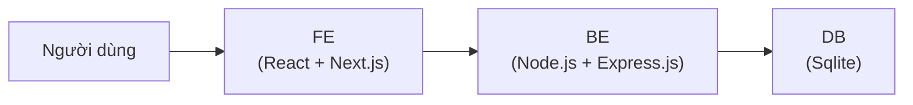
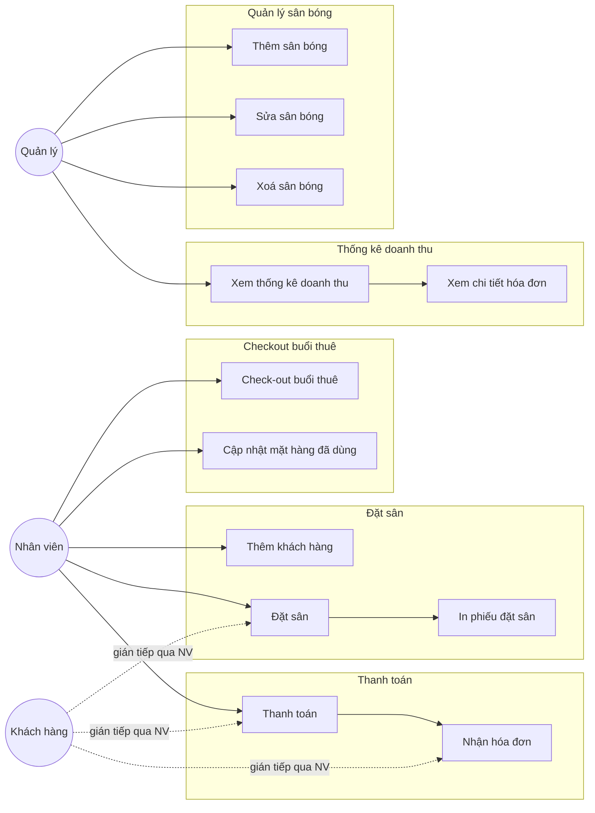
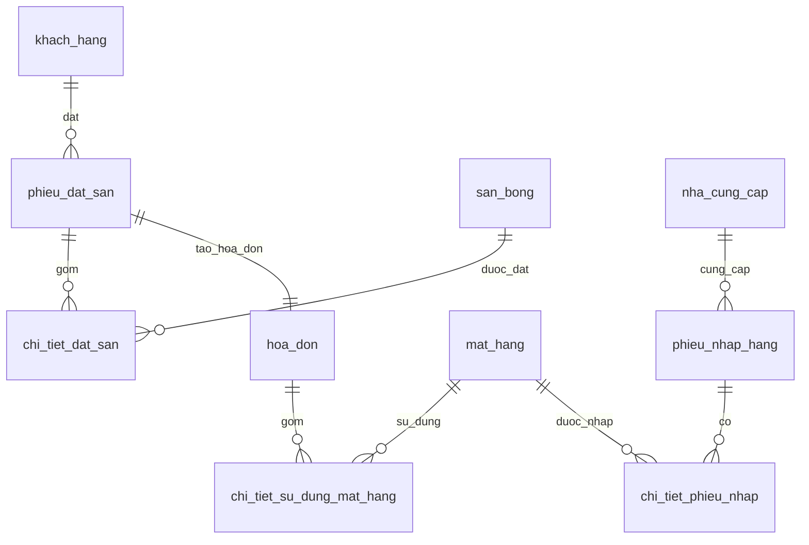
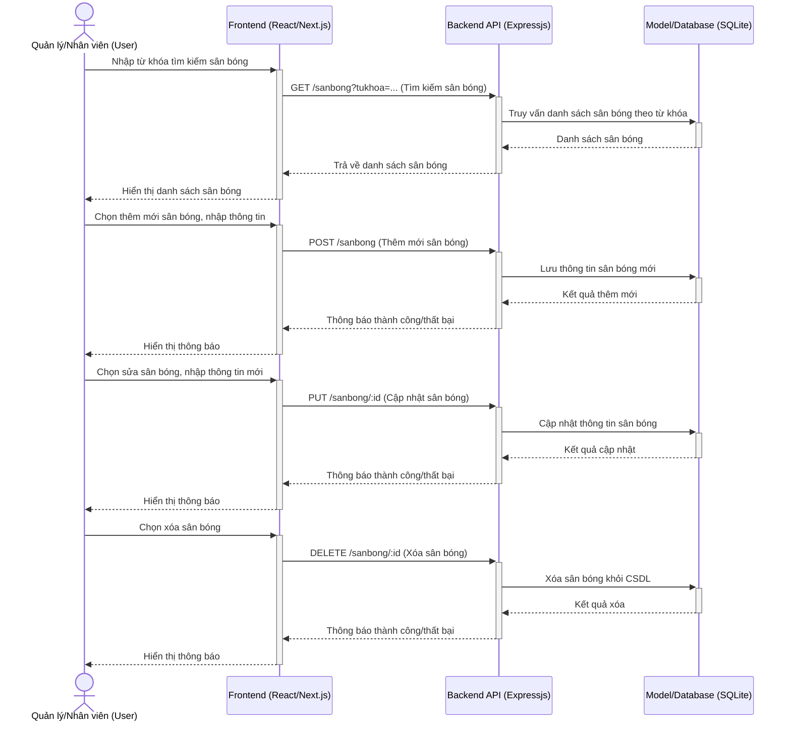
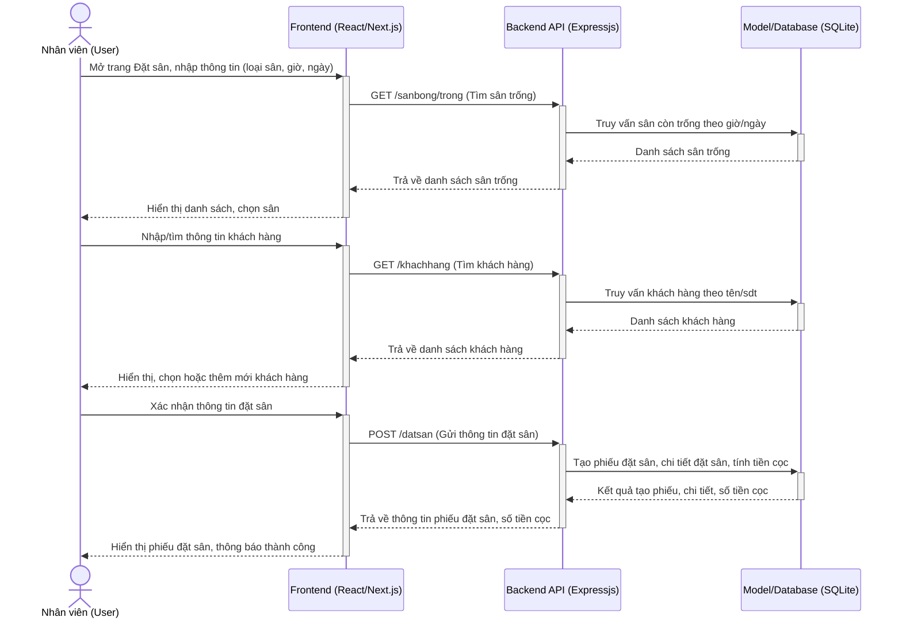
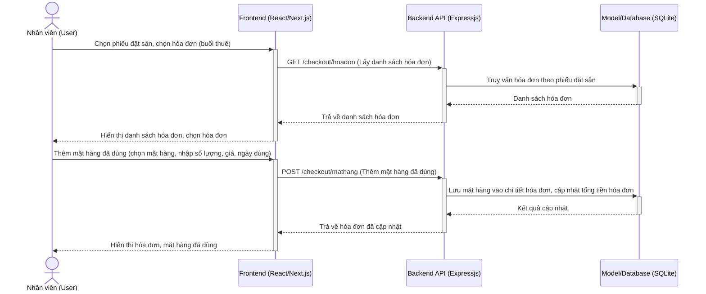
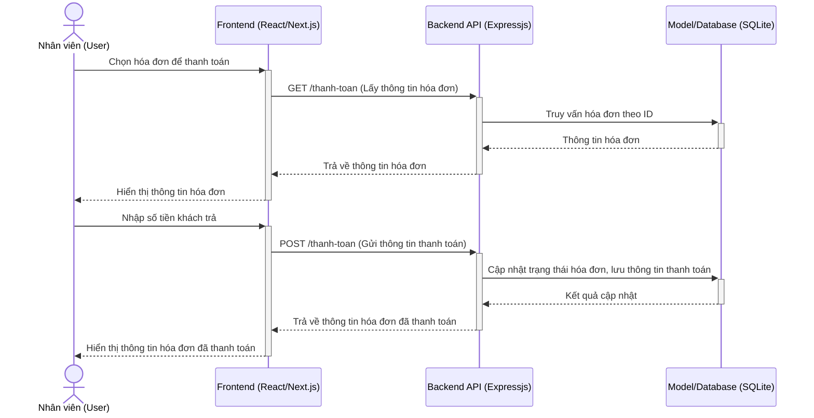
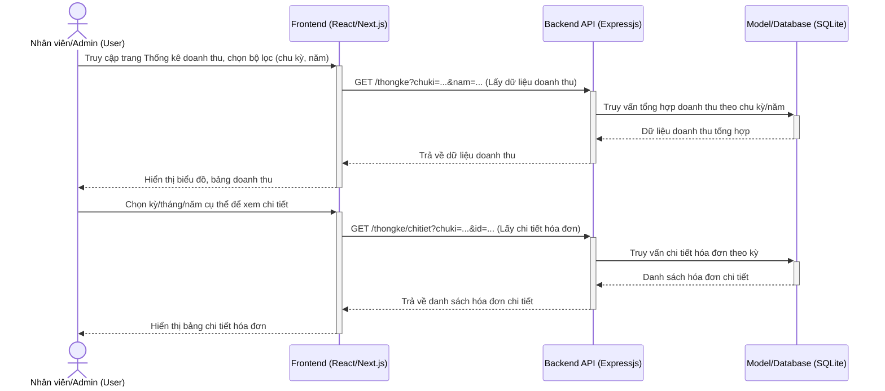
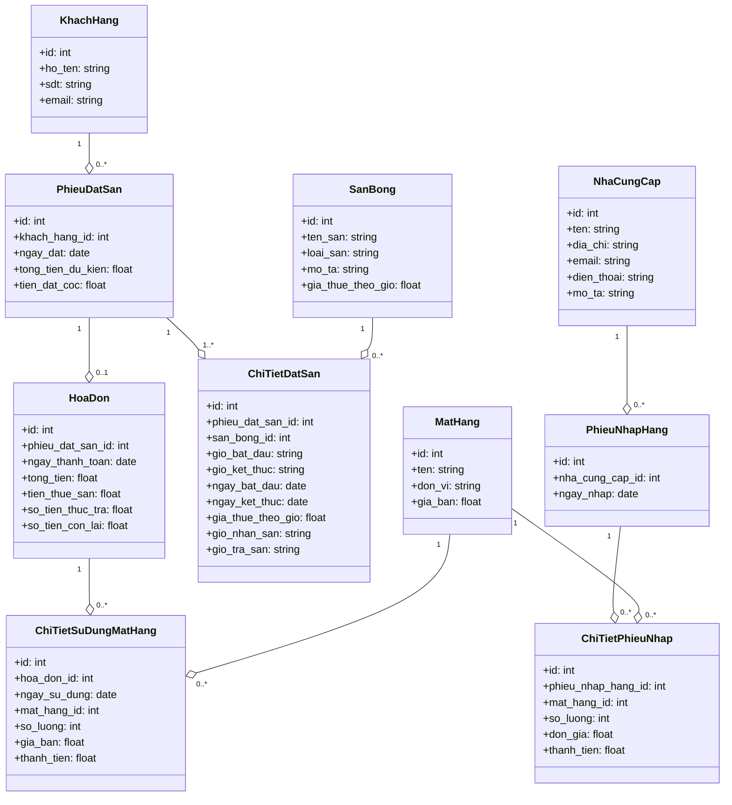
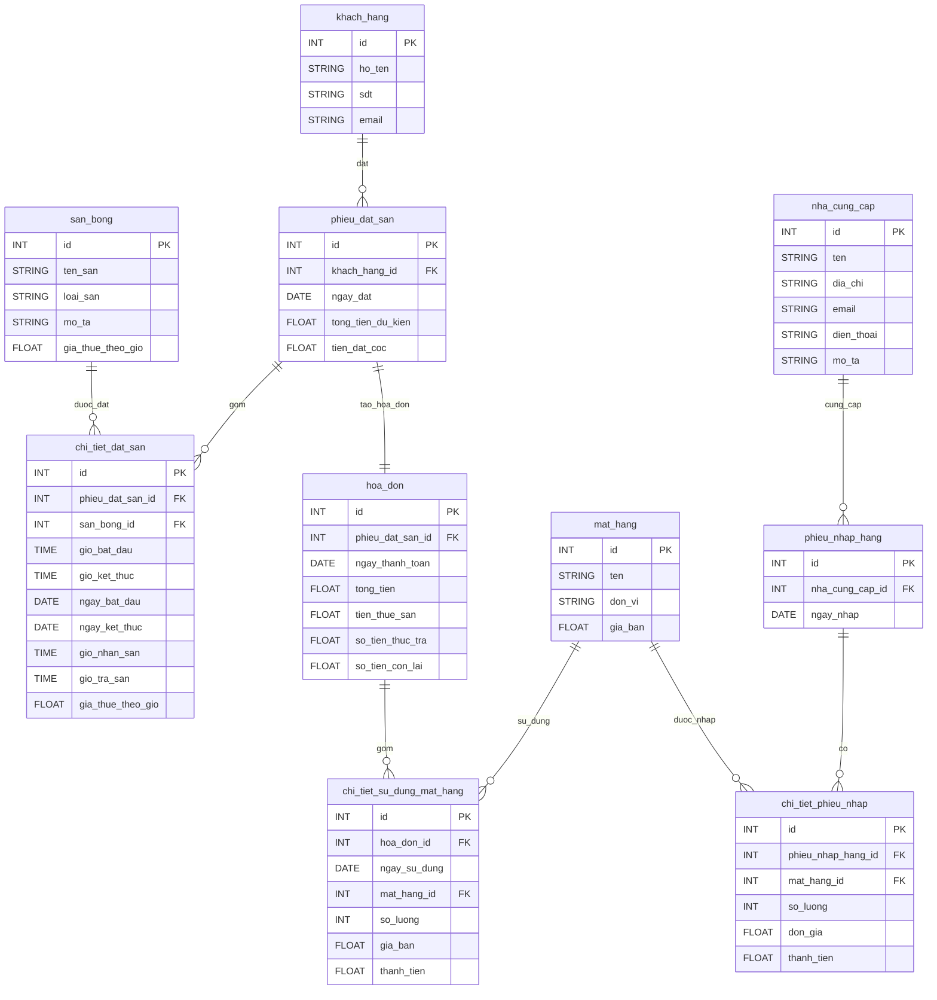

# Báo cáo

## Chương 1. Giới thiệu bài toán và các công nghệ sử dụng

Hệ thống quản lý cho thuê sân bóng mini giúp tự động hóa quy trình đặt sân, thanh toán, quản lý khách hàng, thống kê doanh thu. Hệ thống gồm backend (Node.js, Express, SQLite) và frontend (Next.js, React, TailwindCSS). Giao diện hiện đại, đồng bộ, tập trung vào trải nghiệm người dùng và logic nghiệp vụ thanh toán.

**Công nghệ sử dụng:**
- Backend: Node.js, Express, SQLite
- Frontend: Next.js, React, TailwindCSS
- Thư viện phụ trợ: Heroicons, Axios

**Giải thích các công nghệ sử dụng và ưu điểm:**
- **Node.js & Express (Backend):**
  - Xử lý bất đồng bộ tốt, phù hợp cho ứng dụng realtime, API RESTful.
  - Cộng đồng lớn, nhiều thư viện hỗ trợ, dễ mở rộng.
  - Express giúp tổ chức route, middleware rõ ràng, dễ bảo trì.
- **SQLite (Cơ sở dữ liệu):**
  - Nhẹ, dễ triển khai, không cần cài đặt server riêng.
  - Phù hợp cho ứng dụng vừa/nhỏ, phát triển nhanh, backup đơn giản.
- **Next.js & React (Frontend):**
  - Next.js hỗ trợ SSR, tối ưu SEO, tốc độ tải trang nhanh.
  - React component hóa UI, dễ tái sử dụng, phát triển nhanh.
  - Hỗ trợ hot reload, phát triển giao diện hiện đại, linh hoạt.
- **TailwindCSS:**
  - Thiết kế giao diện nhanh, đồng bộ, responsive, dễ tùy biến theme.
  - Giảm code CSS lặp lại, tối ưu hiệu suất frontend.
- **Axios:**
  - Giao tiếp API đơn giản, hỗ trợ Promise, xử lý lỗi tốt.
- **Heroicons:**
  - Bộ icon hiện đại, dễ tích hợp với React, tăng tính trực quan cho UI.

Kiến trúc tổng quan hệ thống:



## Chương 2. Phân tích và thiết kế hệ thống

### 1. Phân tích hệ thống

#### 1.1. Tác nhân (Actor)

- **Quản trị viên (Admin)**: Có quyền quản lý sân bóng, xem thống kê doanh thu.
- **Nhân viên lễ tân**: Thực hiện toàn bộ nghiệp vụ (quản lý sân, đặt sân, checkout, thanh toán, thống kê).
- **Khách hàng**: Tác nhân gián tiếp, thông qua nhân viên để đặt sân, thanh toán.

#### 1.2 Các use-case chính

- Quản lý sân bóng (thêm, sửa, xóa, tìm kiếm)
- Đặt sân (tìm sân trống, chọn khách, xác nhận đặt)
- Checkout (quản lý mặt hàng, cập nhật hóa đơn)
- Thanh toán (tính toán, cập nhật trạng thái hóa đơn, xử lý trả đủ/nợ/dư)
- Thống kê doanh thu (xem biểu đồ, bảng tổng hợp, chi tiết hóa đơn)

#### 1.3. Sơ đồ use-case chi tiết



#### 1.4. Kịch bản & ngoại lệ

_todo_

- Đặt sân trùng giờ: cảnh báo, không cho phép đặt
- Thanh toán thiếu/dư: cập nhật trạng thái hóa đơn, hiển thị rõ trên UI
- Xóa sân bóng đang có lịch đặt: cảnh báo, không cho phép xóa

#### 1.5. Cơ sở dữ liệu mức logic

Các thực thể chính trong hệ thống:

| Thực thể                    | Vai trò                                                            |
| --------------------------- | ------------------------------------------------------------------ |
| `khach_hang`                | Người thuê sân                                                     |
| `san_bong`                  | Thông tin các sân mini/lớn                                         |
| `phieu_dat_san`             | Phiếu xác nhận đặt sân của khách hàng                              |
| `chi_tiet_dat_san`          | Một dòng đặt sân cụ thể: sân nào, khung giờ, ngày bắt đầu/kết thúc |
| `hoa_don`                   | Hóa đơn thanh toán cuối kỳ                                         |
| `mat_hang`                  | Đồ ăn, nước uống bán kèm                                           |
| `chi_tiet_su_dung_mat_hang` | Danh sách mặt hàng sử dụng mỗi buổi                                |
| `nha_cung_cap`              | Nguồn cung cấp mặt hàng                                            |
| `phieu_nhap_hang`           | Hóa đơn nhập hàng                                                  |
| `chi_tiet_phieu_nhap`       | Mặt hàng nhập cụ thể của 1 phiếu                                   |

Quan hệ giữa các thực thể:



### 2. Thiết kế hệ thống

#### 2.1. Sơ đồ tuần tự

Bao gồm các luồng xử lí sau:
- Quản lý sân bóng
- Đặt sân (_đã bao gồm luồng quản lý khách hàng_)
- Checkout và cập nhật mặt hàng đã dùng
- Thanh toán và xuất hóa đơn
- Xem thống kê doanh thu → xem chi tiết hóa đơn

#### 2.1.1. Quản lý sân bóng



Giải thích:
- Quản lý hoặc nhân viên thao tác trên giao diện để tìm kiếm, thêm mới, sửa, xóa sân bóng.
- Frontend gửi request đến backend (API Express) để thực hiện các thao tác CRUD với sân bóng.
- Backend xử lý logic nghiệp vụ, truy vấn/cập nhật dữ liệu trong SQLite, trả kết quả về frontend.
- Giao diện hiển thị danh sách, thông báo kết quả thao tác cho người dùng.

#### 2.1.2. Đặt sân



Giải thích:
- Nhân viên thao tác trên giao diện để nhập thông tin đặt sân, tìm sân trống, tìm/chọn khách hàng.
- Frontend gửi request đến backend (API Express) để lấy dữ liệu sân trống, khách hàng, và gửi thông tin đặt sân.
- Backend xử lý logic nghiệp vụ, truy vấn/tạo dữ liệu trong SQLite, trả kết quả về frontend.
- Giao diện hiển thị kết quả đặt sân, số tiền cọc, thông báo thành công cho nhân viên.

##### 2.1.3. Checkout và cập nhật mặt hàng đã dùng



Giải thích:
- Nhân viên thao tác trên giao diện để chọn phiếu đặt sân, chọn hóa đơn (buổi thuê), thêm mặt hàng đã dùng.
- Frontend gửi request đến backend (API Express) để lấy danh sách hóa đơn, thêm mặt hàng đã dùng.
- Backend xử lý logic nghiệp vụ, truy vấn/tạo dữ liệu trong SQLite, trả kết quả về frontend.
- Giao diện hiển thị kết quả hóa đơn, mặt hàng đã dùng cho nhân viên.

#### 2.1.4. Thanh toán và xuất hóa đơn



Giải thích:
- Nhân viên thao tác trên giao diện để chọn hóa đơn cần thanh toán, nhập số tiền khách trả.
- Frontend gửi request đến backend (API Express) để lấy thông tin hóa đơn, gửi thông tin thanh toán.
- Backend xử lý logic nghiệp vụ, truy vấn/cập nhật dữ liệu trong SQLite, trả kết quả về frontend.
- Giao diện hiển thị kết quả hóa đơn đã thanh toán cho nhân viên.

#### 2.1.5. Xem thống kê doanh thu



Giải thích:
- Nhân viên hoặc quản trị viên thao tác trên giao diện để chọn bộ lọc thống kê, xem biểu đồ, bảng tổng hợp doanh thu.
- Frontend gửi request đến backend (API Express) để lấy dữ liệu tổng hợp và chi tiết hóa đơn.
- Backend truy vấn dữ liệu tổng hợp/chi tiết từ SQLite, trả kết quả về frontend.
- Giao diện hiển thị biểu đồ, bảng doanh thu, chi tiết hóa đơn cho người dùng.

#### 2.1. Sơ đồ lớp



Các lớp trong hệ thống được thiết kế như sau:

- **SanBong**: Đại diện cho bảng `san_bong` (id, ten_san, loai_san, mo_ta, gia_thue_theo_gio).
- **KhachHang**: Đại diện cho bảng `khach_hang` (id, ho_ten, sdt, email).
- **PhieuDatSan**: Đại diện cho bảng `phieu_dat_san` (id, khach_hang_id, ngay_dat, tong_tien_du_kien, tien_dat_coc).
- **ChiTietDatSan**: Đại diện cho bảng `chi_tiet_dat_san` (id, phieu_dat_san_id, san_bong_id, gio_bat_dau, gio_ket_thuc, ngay_bat_dau, ngay_ket_thuc, gia_thue_theo_gio, gio_nhan_san, gio_tra_san).
- **HoaDon**: Đại diện cho bảng `hoa_don` (id, phieu_dat_san_id, ngay_thanh_toan, tong_tien, tien_thue_san, so_tien_thuc_tra, so_tien_con_lai).
- **MatHang**: Đại diện cho bảng `mat_hang` (id, ten, don_vi, gia_ban).
- **ChiTietSuDungMatHang**: Đại diện cho bảng `chi_tiet_su_dung_mat_hang` (id, hoa_don_id, ngay_su_dung, mat_hang_id, so_luong, gia_ban, thanh_tien).
- **NhaCungCap**: Đại diện cho bảng `nha_cung_cap` (id, ten, dia_chi, email, dien_thoai, mo_ta).
- **PhieuNhapHang**: Đại diện cho bảng `phieu_nhap_hang` (id, nha_cung_cap_id, ngay_nhap).
- **ChiTietPhieuNhap**: Đại diện cho bảng `chi_tiet_phieu_nhap` (id, phieu_nhap_hang_id, mat_hang_id, so_luong, don_gia, thanh_tien).

Quan hệ giữa các lớp/bảng:
- Mỗi khách hàng (`KhachHang`) có thể có nhiều phiếu đặt sân (`PhieuDatSan`).
- Mỗi phiếu đặt sân có nhiều chi tiết đặt sân (`ChiTietDatSan`), mỗi chi tiết liên kết với một sân bóng (`SanBong`).
- Mỗi phiếu đặt sân có thể sinh ra một hóa đơn (`HoaDon`).
- Mỗi hóa đơn có nhiều chi tiết sử dụng mặt hàng (`ChiTietSuDungMatHang`), mỗi chi tiết liên kết với một mặt hàng (`MatHang`).
- Mỗi mặt hàng có thể xuất hiện trong nhiều phiếu nhập hàng (`ChiTietPhieuNhap`), mỗi phiếu nhập hàng thuộc về một nhà cung cấp (`NhaCungCap`).

#### 2.2. Sơ đồ CSDL

Mô tả chi tiết các bảng, trường và quan hệ:

- **khach_hang**: Lưu thông tin khách hàng (id, ho_ten, sdt, email).
- **san_bong**: Thông tin các sân bóng (id, ten_san, loai_san, mo_ta, gia_thue_theo_gio).
- **phieu_dat_san**: Phiếu xác nhận đặt sân của khách hàng (id, khach_hang_id, ngay_dat, tong_tien_du_kien, tien_dat_coc).
- **chi_tiet_dat_san**: Chi tiết từng lần đặt sân (id, phieu_dat_san_id, san_bong_id, gio_bat_dau, gio_ket_thuc, ngay_bat_dau, ngay_ket_thuc, gia_thue_theo_gio, gio_nhan_san, gio_tra_san).
- **hoa_don**: Hóa đơn thanh toán (id, phieu_dat_san_id, ngay_thanh_toan, tong_tien, tien_thue_san, so_tien_thuc_tra, so_tien_con_lai).
- **mat_hang**: Đồ ăn, nước uống bán kèm (id, ten, don_vi, gia_ban).
- **chi_tiet_su_dung_mat_hang**: Danh sách mặt hàng sử dụng mỗi buổi (id, hoa_don_id, ngay_su_dung, mat_hang_id, so_luong, gia_ban, thanh_tien).
- **nha_cung_cap**: Nguồn cung cấp mặt hàng (id, ten, dia_chi, email, dien_thoai, mo_ta).
- **phieu_nhap_hang**: Hóa đơn nhập hàng (id, nha_cung_cap_id, ngay_nhap).
- **chi_tiet_phieu_nhap**: Mặt hàng nhập cụ thể của 1 phiếu (id, phieu_nhap_hang_id, mat_hang_id, so_luong, don_gia, thanh_tien).

Các ràng buộc khóa ngoại (FOREIGN KEY) đảm bảo tính toàn vẹn dữ liệu giữa các bảng:
- `phieu_dat_san.khach_hang_id` → `khach_hang.id`
- `chi_tiet_dat_san.phieu_dat_san_id` → `phieu_dat_san.id`
- `chi_tiet_dat_san.san_bong_id` → `san_bong.id`
- `hoa_don.phieu_dat_san_id` → `phieu_dat_san.id`
- `chi_tiet_su_dung_mat_hang.hoa_don_id` → `hoa_don.id`
- `chi_tiet_su_dung_mat_hang.mat_hang_id` → `mat_hang.id`
- `phieu_nhap_hang.nha_cung_cap_id` → `nha_cung_cap.id`
- `chi_tiet_phieu_nhap.phieu_nhap_hang_id` → `phieu_nhap_hang.id`
- `chi_tiet_phieu_nhap.mat_hang_id` → `mat_hang.id`

Sơ đồ ERD chi tiết:



## Chương 3. Cài đặt và thử nghiệm hệ thống

### 3.1. Cài đặt

#### 3.1.1. Chuẩn bị môi trường

- Cài đặt Node.js (phiên bản >= 14)
- Cài đặt SQLite (phiên bản >= 3.31)
- Cài đặt Git để clone source code
- Cài đặt curl để thử nghiệm API

#### 3.1.2. Cơ sở dữ liệu

Tạo CSDL SQLite: tạo file `db/qlsb.db` bằng lệnh sau:
```bash
sqlite3 db/qlsb.db < db/schema.sql
```

Khởi tạo dữ liệu mẫu:
```bash
sqlite3 db/qlsb.db < db/seed.sql
```

#### 3.1.3. Backend

- Vào thư mục backend: `cd backend`
- Cài dependencies: `npm install` trong thư mục backend
- Khởi động server: `npm run dev` (port mặc định 5000)

#### Frontend

- Vào thư mục frontend: `cd frontend`
- Cài dependencies: `npm install` trong thư mục frontend
- Chạy: `npm run dev` (port mặc định 3000)
- Truy cập giao diện: `http://localhost:3000`

### 3.2. Thử nghiệm

#### 3.2.1. Cơ sở dữ liệu

Truy cập CSDL SQLite để kiểm tra dữ liệu:
```bash
sqlite3 db/qlsb.db
```

Thực hiện các truy vấn SQL để kiểm tra dữ liệu.

#### 3.2.2. Backend

- Thử nghiệm API bằng curl:
  - GET/POST/PUT/DELETE các route `/sanbong`, `/datsan`, `/checkout`, `/thanh-toan`, `/thongke`
  - Ví dụ: `curl http://localhost:3001/api/sanbong`

#### Frontend

- Truy cập giao diện web tại `http://localhost:3000`, thực hiện các tính năng:
  - Tìm kiếm sân bóng, thêm/sửa/xóa sân
  - Đặt sân, chọn khách hàng, xác nhận đặt
  - Checkout mặt hàng đã dùng, cập nhật hóa đơn
  - Thanh toán hóa đơn, nhập số tiền khách trả
  - Xem thống kê doanh thu, chi tiết hóa đơn

- Hoặc truy cập trực tiếp các trang:
  - `/san-bong`: Quản lý sân bóng (thêm, sửa, xóa, tìm kiếm)
  - `/dat-san`: Đặt sân (tìm sân trống, chọn khách, xác nhận đặt)
  - `/checkout`: Quản lý mặt hàng, cập nhật hóa đơn
  - `/thanh-toan`: Thanh toán hóa đơn, nhập số tiền khách trả, xem trạng thái thanh toán
  - `/thong-ke`: Thống kê doanh thu, xem biểu đồ, bảng tổng hợp, chi tiết hóa đơn

- Kiểm thử các trường hợp bổ sung:
  - Đặt sân trùng giờ, đặt nhiều ngày, đặt cho khách mới/cũ
  - Thêm/xóa/sửa mặt hàng khi checkout
  - Thanh toán thiếu/dư, kiểm tra trạng thái hóa đơn
  - Xem thống kê doanh thu theo tháng/năm, xem chi tiết hóa đơn
