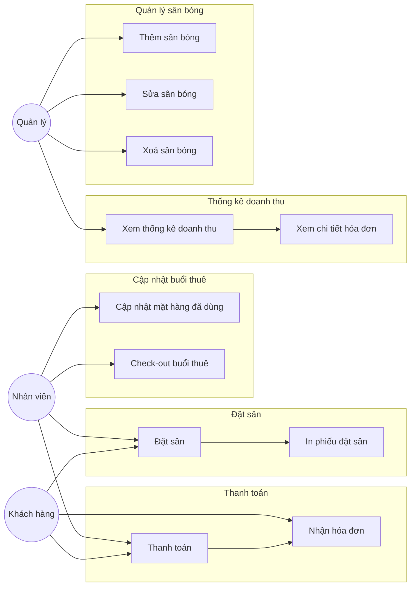
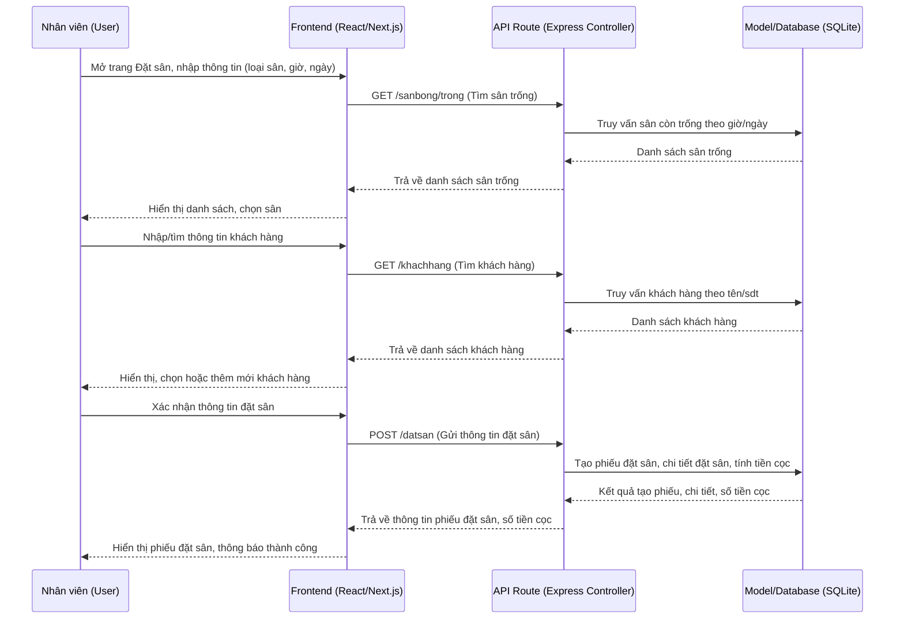
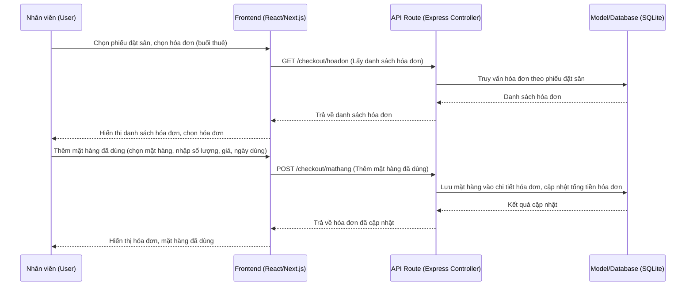
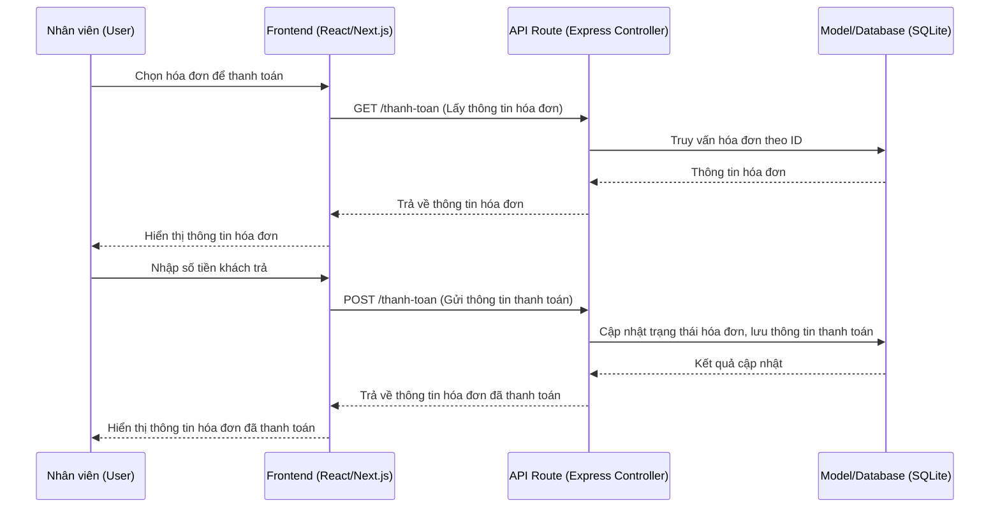
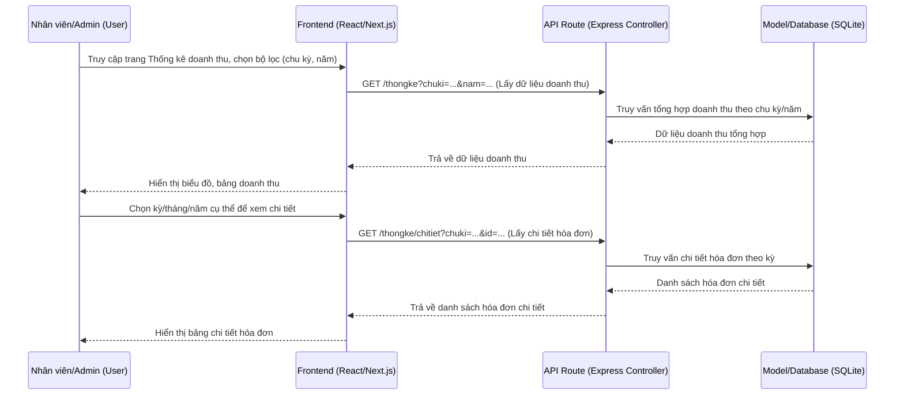

# Báo cáo

## Chương 1. Giới thiệu bài toán và các công nghệ sử dụng

Hệ thống quản lý cho thuê sân bóng mini giúp tự động hóa quy trình đặt sân, thanh toán, quản lý khách hàng, thống kê doanh thu. Hệ thống gồm backend (Node.js, Express, SQLite) và frontend (Next.js, React, TailwindCSS). Giao diện hiện đại, đồng bộ, tập trung vào trải nghiệm người dùng và logic nghiệp vụ thanh toán.

**Công nghệ sử dụng:**
- Backend: Node.js, Express, SQLite
- Frontend: Next.js, React, TailwindCSS
- Thư viện phụ trợ: Heroicons, Axios

**Giải thích các công nghệ sử dụng và ưu điểm:**
- **Node.js & Express (Backend):**
  - Xử lý bất đồng bộ tốt, phù hợp cho ứng dụng realtime, API RESTful.
  - Cộng đồng lớn, nhiều thư viện hỗ trợ, dễ mở rộng.
  - Express giúp tổ chức route, middleware rõ ràng, dễ bảo trì.
- **SQLite (Cơ sở dữ liệu):**
  - Nhẹ, dễ triển khai, không cần cài đặt server riêng.
  - Phù hợp cho ứng dụng vừa/nhỏ, phát triển nhanh, backup đơn giản.
- **Next.js & React (Frontend):**
  - Next.js hỗ trợ SSR, tối ưu SEO, tốc độ tải trang nhanh.
  - React component hóa UI, dễ tái sử dụng, phát triển nhanh.
  - Hỗ trợ hot reload, phát triển giao diện hiện đại, linh hoạt.
- **TailwindCSS:**
  - Thiết kế giao diện nhanh, đồng bộ, responsive, dễ tùy biến theme.
  - Giảm code CSS lặp lại, tối ưu hiệu suất frontend.
- **Heroicons:**
  - Bộ icon hiện đại, dễ tích hợp với React, tăng tính trực quan cho UI.
- **Axios:**
  - Giao tiếp API đơn giản, hỗ trợ Promise, xử lý lỗi tốt.

## Chương 2. Phân tích và thiết kế hệ thống

### 1. Phân tích hệ thống

#### 1.1. Tác nhân (Actor)

- Quản trị viên (Admin): Có quyền quản lý sân bóng, xem thống kê doanh thu.
- Nhân viên lễ tân: Thực hiện toàn bộ nghiệp vụ (quản lý sân, đặt sân, checkout, thanh toán, thống kê).
- Khách hàng: Tác nhân gián tiếp, thông qua nhân viên để đặt sân, thanh toán.

#### 1.2 Các use-case chính

- Quản lý sân bóng (thêm, sửa, xóa, tìm kiếm)
- Đặt sân (tìm sân trống, chọn khách, xác nhận đặt)
- Checkout (quản lý mặt hàng, cập nhật hóa đơn)
- Thanh toán (tính toán, cập nhật trạng thái hóa đơn, xử lý trả đủ/nợ/dư)
- Thống kê doanh thu (xem biểu đồ, bảng tổng hợp, chi tiết hóa đơn)

#### 1.3. Sơ đồ use-case chi tiết

#### 1.4. Kịch bản & ngoại lệ

- Đặt sân trùng giờ: cảnh báo, không cho phép đặt
- Thanh toán thiếu/dư: cập nhật trạng thái hóa đơn, hiển thị rõ trên UI
- Xóa sân bóng đang có lịch đặt: cảnh báo, không cho phép xóa

### 2. Thiết kế hệ thống

#### 2.1. Sơ đồ tuần tự

Bao gồm các luồng xử lí sau:
- Đặt sân
- Checkout và cập nhật mặt hàng đã dùng
- Thanh toán và xuất hóa đơn
- Xem thống kê doanh thu → xem chi tiết hóa đơn

#### 2.1.1 Đặt sân

Giải thích:
- Nhân viên thao tác trên giao diện để nhập thông tin đặt sân, tìm sân trống, tìm/chọn khách hàng.
- Frontend gửi request đến backend (API Express) để lấy dữ liệu sân trống, khách hàng, và gửi thông tin đặt sân.
- Backend xử lý logic nghiệp vụ, truy vấn/tạo dữ liệu trong SQLite, trả kết quả về frontend.
- Giao diện hiển thị kết quả đặt sân, số tiền cọc, thông báo thành công cho nhân viên.

##### 2.1.2 Checkout và cập nhật mặt hàng đã dùng

Giải thích:
- Nhân viên thao tác trên giao diện để chọn phiếu đặt sân, chọn hóa đơn (buổi thuê), thêm mặt hàng đã dùng.
- Frontend gửi request đến backend (API Express) để lấy danh sách hóa đơn, thêm mặt hàng đã dùng.
- Backend xử lý logic nghiệp vụ, truy vấn/tạo dữ liệu trong SQLite, trả kết quả về frontend.
- Giao diện hiển thị kết quả hóa đơn, mặt hàng đã dùng cho nhân viên.

#### 2.1.3 Thanh toán và xuất hóa đơn

Giải thích:
- Nhân viên thao tác trên giao diện để chọn hóa đơn cần thanh toán, nhập số tiền khách trả.
- Frontend gửi request đến backend (API Express) để lấy thông tin hóa đơn, gửi thông tin thanh toán.
- Backend xử lý logic nghiệp vụ, truy vấn/cập nhật dữ liệu trong SQLite, trả kết quả về frontend.
- Giao diện hiển thị kết quả hóa đơn đã thanh toán cho nhân viên.

#### 2.1.4 Xem thống kê doanh thu

Giải thích:
- Nhân viên hoặc quản trị viên thao tác trên giao diện để chọn bộ lọc thống kê, xem biểu đồ, bảng tổng hợp doanh thu.
- Frontend gửi request đến backend (API Express) để lấy dữ liệu tổng hợp và chi tiết hóa đơn.
- Backend truy vấn dữ liệu tổng hợp/chi tiết từ SQLite, trả kết quả về frontend.
- Giao diện hiển thị biểu đồ, bảng doanh thu, chi tiết hóa đơn cho người dùng.

#### 2.1. Sơ đồ lớp

  - SanBong, KhachHang, PhieuDatSan, ChiTietDatSan, HoaDon, MatHang, ChiTietHoaDon

#### 2.2. Sơ đồ CSDL

  - Các bảng: san_bong, khach_hang, phieu_dat_san, chi_tiet_dat_san, hoa_don, mat_hang, chi_tiet_hoa_don

## Chương 3. Cài đặt và thử nghiệm hệ thống

### 3.1. Cài đặt

#### Backend
- Cài Node.js, clone source code
- Cài dependencies: `npm install` trong thư mục backend
- Khởi động server: `npm start` (port mặc định 3001)
- CSDL SQLite: file `db/qlsb.db`, có sẵn script tạo bảng và seed dữ liệu

#### Frontend
- Cài Node.js, clone source code
- Cài dependencies: `npm install` trong thư mục frontend
- Chạy: `npm run dev` (port mặc định 3000)
- Cài thêm: `npm install @heroicons/react` để hiển thị icon

### 2. Thử nghiệm

#### Backend
- Thử nghiệm API bằng curl hoặc Postman:
  - GET/POST/PUT/DELETE các route `/sanbong`, `/datsan`, `/checkout`, `/thanh-toan`, `/thongke`
  - Ví dụ: `curl http://localhost:3001/api/sanbong`

#### Frontend
- Truy cập các trang:
  - `/san-bong`: Quản lý sân bóng (thêm, sửa, xóa, tìm kiếm)
  - `/dat-san`: Đặt sân (tìm sân trống, chọn khách, xác nhận đặt)
  - `/checkout`: Quản lý mặt hàng, cập nhật hóa đơn
  - `/thanh-toan`: Thanh toán hóa đơn, nhập số tiền khách trả, xem trạng thái thanh toán
  - `/thong-ke`: Thống kê doanh thu, xem biểu đồ, bảng tổng hợp, chi tiết hóa đơn
- Kiểm thử các trường hợp:
  - Đặt sân trùng giờ, đặt nhiều ngày, đặt cho khách mới/cũ
  - Thêm/xóa/sửa mặt hàng khi checkout
  - Thanh toán thiếu/dư, kiểm tra trạng thái hóa đơn
  - Xem thống kê doanh thu theo tháng/năm, xem chi tiết hóa đơn

---

**Ghi chú:**
- Giao diện đã được chuẩn hóa, đồng bộ layout, tối ưu trải nghiệm người dùng.
- Logic nghiệp vụ thanh toán, đồng bộ dữ liệu, reload sau thao tác đã được kiểm thử kỹ.
- Có thể mở rộng thêm các chức năng quản lý nhân viên, phân quyền, xuất báo cáo PDF, v.v.
