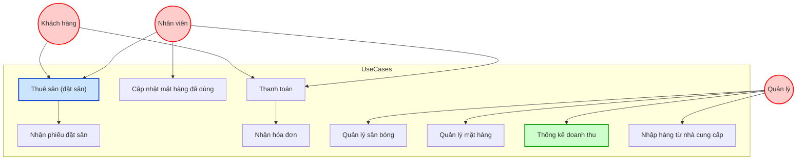
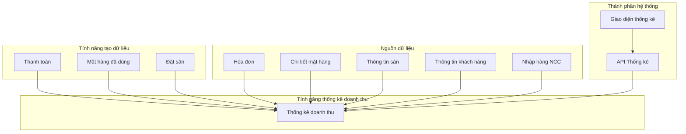
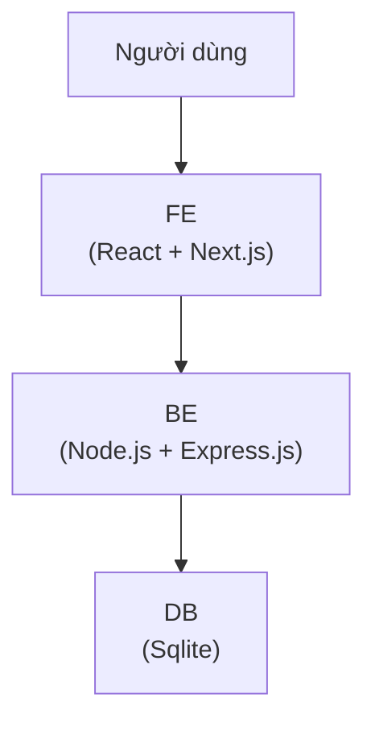
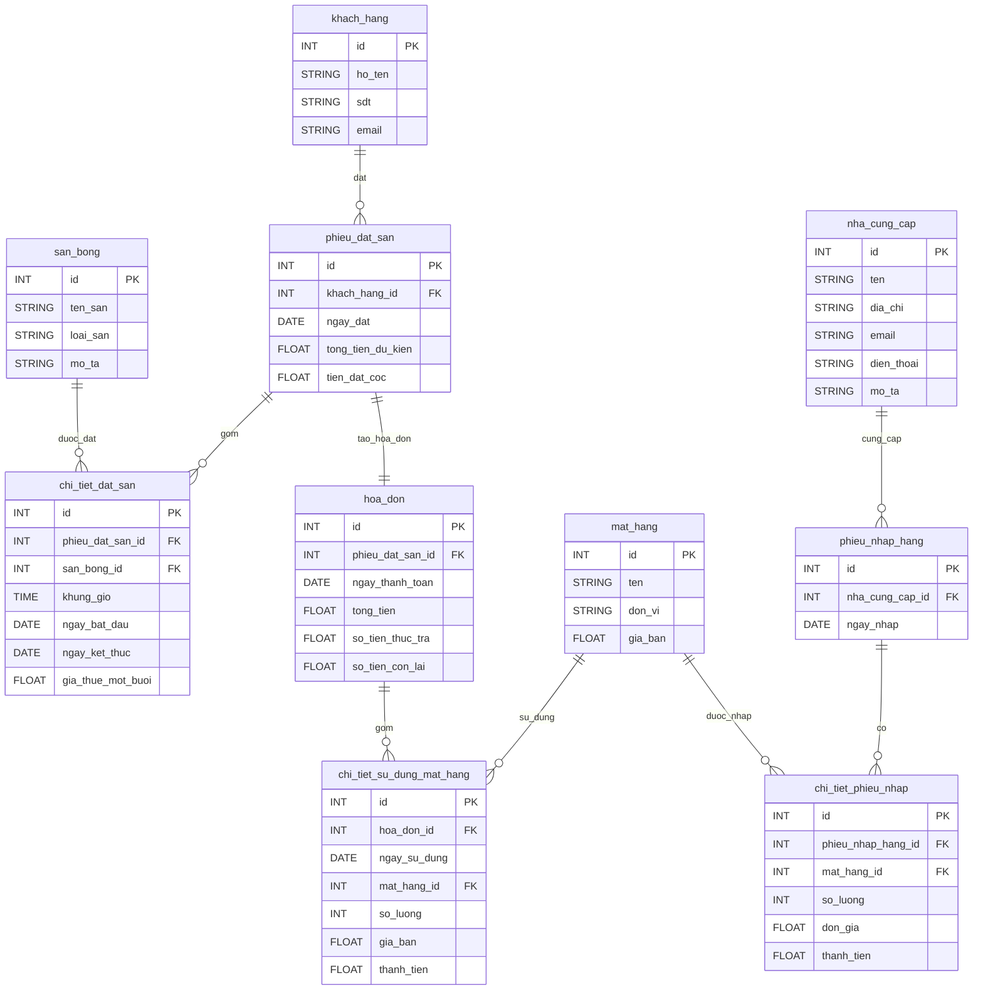

# Hệ thống cho thuê sân bóng mini

Cách tiếp cận:
1. Phân tích yêu cầu
2. Thiết kế Use case diagram
3. Thiết kế kiến trúc tổng quan hệ thống và công nghệ sử dụng
4. Thiết kế ERD và Database
5. Thiết kế API
6. Thiết kế UI/UX

Hoặc tham khảo hướng Data-driven development:

| Giai đoạn                                         | Mục tiêu                                                                    | Kết quả                                                         |
| ------------------------------------------------- | --------------------------------------------------------------------------- | --------------------------------------------------------------- |
| **1. Phân tích dữ liệu nghiệp vụ**                | Xác định các **thực thể**, **mối quan hệ**, **nghiệp vụ phát sinh dữ liệu** | Danh sách thực thể: Khách hàng, Hóa đơn, Mặt hàng, Đặt sân, ... |
| **2. Thiết kế ERD (Entity Relationship Diagram)** | Cấu trúc hóa dữ liệu: bảng, khóa chính, khóa ngoại, ràng buộc               | Sơ đồ ERD chính thức                                            |
| **3. Thiết kế Physical Database Schema**          | Chuyển ERD thành lược đồ SQL cụ thể (PostgreSQL/MySQL...)                   | Câu lệnh `CREATE TABLE`, ràng buộc FK, chỉ mục                  |
| **4. Phân tích usecase → truy vấn dữ liệu**       | Đặt câu hỏi: thống kê cần gì? hóa đơn cần dữ liệu nào?                      | Danh sách các truy vấn mẫu, chỉ số cần thống kê                 |
| **5. Thiết kế API phù hợp dữ liệu**               | Xây dựng API đọc dữ liệu đúng với mô hình                                   | REST/GraphQL APIs rõ ràng, phân trang, lọc                      |
| **6. UI & Use Case Logic (sau cùng)**             | Thiết kế màn hình để hiện dữ liệu từ DB/APIs                                | Giao diện thống kê, hóa đơn, tìm kiếm khách hàng                |

## I. Usecase

### 1. Use case diagram tổng quan



**📝 Giải thích sơ bộ:**

Khách hàng có thể:
- Đặt sân
- Nhận phiếu đặt sân
- Thanh toán và nhận hóa đơn

Nhân viên có vai trò trung gian thực hiện thao tác:
- Đặt sân thay khách
- Cập nhật mặt hàng đã dùng mỗi buổi
- Xử lý thanh toán

Quản lý:
- Quản lý thông tin sân bóng
- Nhập và quản lý mặt hàng
- **Xem thống kê doanh thu**
- Nhập hàng từ nhà cung cấp

### 2. Use case diagram chi tiết cho chức năng Thống kê doanh thu



#### Dữ liệu đầu vào

| Nguồn dữ liệu                | Mô tả chi tiết                                                                                                                      |
| ---------------------------- | ----------------------------------------------------------------------------------------------------------------------------------- |
| **Hóa đơn thanh toán**       | Bao gồm thông tin: khách hàng, sân thuê, thời gian, chi phí thuê, mặt hàng sử dụng, số tiền đã trả. Đây là nguồn chính để thống kê. |
| **Mặt hàng ăn uống đã dùng** | Được cập nhật từ chức năng "Checkout buổi thuê" sau khi khách đá xong, dùng để thống kê doanh thu từ dịch vụ kèm theo.              |
| **Thông tin sân bóng**       | Để phân tích doanh thu theo từng sân mini/lớn.                                                                                      |
| **Thông tin khách hàng**     | Phục vụ phân loại doanh thu theo nhóm KH nếu cần (cá nhân, tổ chức, thuê theo tháng...).                                            |

#### Các tính năng liên quan

| Tính năng                     | Mối liên hệ                                                                                         |
| ----------------------------- | --------------------------------------------------------------------------------------------------- |
| **Thanh toán**                | Là nơi tạo ra dữ liệu hóa đơn, quyết định thời gian - số tiền cần ghi nhận trong thống kê.          |
| **Cập nhật mặt hàng đã dùng** | Ảnh hưởng đến phần doanh thu từ dịch vụ phụ trợ (nước uống, đồ ăn).                                 |
| **Đặt sân**                   | Tác động gián tiếp đến thống kê bằng cách tạo ra dự kiến thu (nếu muốn phân tích hiệu quả đặt sân). |
| **Nhập hàng từ nhà cung cấp** | Nếu hệ thống tính lợi nhuận = doanh thu - chi phí thì cần dùng dữ liệu nhập hàng để phân tích.      |
| **Giao diện thống kê (UI)**   | Cho phép quản lý chọn khoảng thời gian (tháng, quý, năm), xem bảng thống kê và chi tiết hóa đơn.    |
| **API thống kê (Backend)**    | Nhận yêu cầu thống kê từ UI, truy vấn DB, tổng hợp dữ liệu, trả về kết quả.                         |

#### Phụ thuộc hệ thống

CSDL:
- Bảng `hoa_don` (invoice)
- Bảng `chi_tiet_mat_hang_da_dung`
- Bảng `san_bong`, `khach_hang`, `mat_hang`, `nha_cung_cap`

API:
- `GET /thong-ke?type=thang&year=2025`
- `GET /hoa-don?from=2025-04-01&to=2025-04-30`

UI/UX:
- Dropdown chọn tháng/quý/năm
- Bảng tổng hợp doanh thu
- Bảng chi tiết hóa đơn trong từng dòng thống kê

## II. Kiến trúc tổng quan hệ thống



**Lựa chọn công nghệ:**

### 1. DB

**Câu hỏi:** nên dùng SQL hay NoSQL?

| Tiêu chí                       | SQL (SQLite)                                                                                          | NoSQL (MongoDB)                                                  |
| ------------------------------ | ----------------------------------------------------------------------------------------------------- | ---------------------------------------------------------------- |
| **Tính chất dữ liệu**          | Có cấu trúc rõ ràng, nhiều quan hệ (relationship)                                                     | Dữ liệu bán cấu trúc, thiên về document                          |
| **Sự phù hợp với nghiệp vụ**   | Tuyệt vời: hệ thống có **hợp đồng, phiếu đặt sân, hóa đơn, mặt hàng, khách hàng**, nhiều ràng buộc FK | Không tối ưu: sẽ phải dùng join bằng code, mất ràng buộc dữ liệu |
| **Khả năng truy vấn thống kê** | Rất mạnh nhờ SQL (`GROUP BY`, `JOIN`, `SUM`, `DATE_TRUNC`,...)                                        | Có aggregation nhưng phức tạp và verbose                         |
| **Mức độ thay đổi cấu trúc**   | Ràng buộc chặt → dễ kiểm soát                                                                         | Linh hoạt → dễ lộn xộn nếu không kiểm soát                       |
| **Dễ debug & maintain**        | Cao                                                                                                   | Thấp hơn nếu dữ liệu bị lồng sâu                                 |
| **Công cụ hỗ trợ**             | Phong phú (ERD tool, SQL Studio, DB Browser)                                                          | Có nhưng thiên về developer, ít hỗ trợ quản trị tổng thể         |

**Kết luận:** 
- **SQL** là lựa chọn tốt hơn cho hệ thống này vì bài toán thiên về dữ liệu dạng bảng và có quan hệ chặt, có nhiều ràng buộc dữ liệu, cần tính toán thống kê và liên kết nhiều bảng.
- **SQLite** là lựa chọn đơn giản và dễ tiếp cận, có thể chuyển sang PostgreSQL hoặc MS SQL Server sau này nếu cần.

### 2. Backend

**Công nghệ:** Node.js + Express.js

**Lý do chọn lựa:**
- **Node.js**: Nền tảng JavaScript phổ biến, dễ dàng mở rộng và có hiệu suất cao cho các ứng dụng I/O.
- **Express.js**: Framework nhẹ cho Node.js, giúp xây dựng API nhanh chóng và dễ dàng.

### 3. Frontend

**Công nghệ:** React + Next.js

**Lý do chọn lựa:**
- **React**: Thư viện JavaScript phổ biến cho việc xây dựng giao diện người dùng, cho phép tái sử dụng component.
- **Next.js**: Framework cho React, hỗ trợ SSR (Server-Side Rendering) và tối ưu hóa hiệu suất.

## III. Thiết kế ERD và Database

### 1. Tóm tắt các thực thể chính (Entities)

| Thực thể                    | Vai trò                                                            |
| --------------------------- | ------------------------------------------------------------------ |
| `khach_hang`                | Người thuê sân                                                     |
| `san_bong`                  | Thông tin các sân mini/lớn                                         |
| `phieu_dat_san`             | Phiếu xác nhận đặt sân của khách hàng                              |
| `chi_tiet_dat_san`          | Một dòng đặt sân cụ thể: sân nào, khung giờ, ngày bắt đầu/kết thúc |
| `hoa_don`                   | Hóa đơn thanh toán cuối kỳ                                         |
| `mat_hang`                  | Đồ ăn, nước uống bán kèm                                           |
| `chi_tiet_su_dung_mat_hang` | Danh sách mặt hàng sử dụng mỗi buổi                                |
| `nha_cung_cap`              | Nguồn cung cấp mặt hàng                                            |
| `phieu_nhap_hang`           | Hóa đơn nhập hàng                                                  |
| `chi_tiet_phieu_nhap`       | Mặt hàng nhập cụ thể của 1 phiếu                                   |

### 2. Thiết kế ERD



Chú thích:
- Các bảng `chi_tiet_*` cho phép mô hình hóa 1-nhiều linh hoạt và rõ ràng.
- `hoa_don` tách riêng khỏi `phieu_dat_san` để phản ánh biến động phát sinh thực tế (thêm buổi, đồ ăn...).
- `mat_hang` có thể dùng chung cho cả bán lẻ và nhập kho, nhờ phân biệt qua `chi_tiet_su_dung_mat_hang` và `chi_tiet_phieu_nhap`.

### 3. Thiết kế Database

Tham khảo file [schema.sql](db/schema.sql) để biết chi tiết về cấu trúc bảng và các ràng buộc.


### 4. Dữ liệu mẫu

Dữ liệu mẫu tham khảo trong file [seed.sql](db/seed.sql).

Clean data tham khảo file [clean.sql](db/clean.sql).


### 5. Truy vấn mẫu 

#### Thống kê doanh thu

📅 Doanh thu theo tháng:
```sql
SELECT 
    strftime('%Y-%m', ngay_thanh_toan) AS thang,
    SUM(tong_tien) AS tong_doanh_thu
FROM hoa_don
GROUP BY thang
ORDER BY thang DESC;
```

🧾 Chi tiết hóa đơn trong một tháng:
```sql
SELECT
    hd.id AS hoa_don_id,
    kh.ho_ten AS ten_khach,
    sb.ten_san,
    hd.ngay_thanh_toan,
    hd.tong_tien
FROM hoa_don hd
JOIN phieu_dat_san pds ON pds.id = hd.phieu_dat_san_id
JOIN khach_hang kh ON kh.id = pds.khach_hang_id
JOIN chi_tiet_dat_san ctds ON ctds.phieu_dat_san_id = pds.id
JOIN san_bong sb ON sb.id = ctds.san_bong_id
WHERE strftime('%Y-%m', hd.ngay_thanh_toan) = '2025-04';
```

🍹 Doanh thu từ mặt hàng:
```sql
SELECT
    mh.ten,
    SUM(c.so_luong) AS tong_so_luong,
    SUM(c.thanh_tien) AS tong_doanh_thu
FROM chi_tiet_su_dung_mat_hang c
JOIN mat_hang mh ON mh.id = c.mat_hang_id
GROUP BY mh.id
ORDER BY tong_doanh_thu DESC;
```

#### Quản lí sân bóng

Các chức năng:
- 🔍 Tìm sân bóng theo tên (LIKE keyword)
- 🧾 Xem chi tiết sân bóng theo ID
- ✏️ Cập nhật thông tin sân bóng
- ➕ Thêm mới sân bóng
- ❌ Xóa sân bóng

**🔍 1. Tìm kiếm sân bóng theo tên**

```sql
SELECT * FROM san_bong
WHERE ten_san LIKE '%' || :keyword || '%';
```

**🧾 2. Xem chi tiết sân bóng theo ID**

```sql
SELECT * FROM san_bong
WHERE id = :id;
```

**✏️ 3. Cập nhật thông tin sân bóng**

```sql
UPDATE san_bong
SET ten_san = :ten_san,
    loai_san = :loai_san,
    mo_ta = :mo_ta
WHERE id = :id;
```

**➕ 4. Thêm mới sân bóng**

```sql
INSERT INTO san_bong (ten_san, loai_san, mo_ta)
VALUES (:ten_san, :loai_san, :mo_ta);
```

**❌ 5. Xóa sân bóng**

```sql
DELETE FROM san_bong
WHERE id = :id;
```

**⚠️ Lưu ý:** Nên kiểm tra xem sân có đang được sử dụng trong các phiếu đặt sân trước khi xoá.

## IV. Thiết kế API

### 1. API thống kê doanh thu

_todo_

### 2. API chi tiết hóa đơn

_todo_

## V. Thiết kế UI/UX

### 1. Giao diện thống kê doanh thu

_todo_

### 2. Giao diện chi tiết hóa đơn

_todo_

## X. Tổng kết

### ✅ Những gì đã thực hiện

| Hạng mục                                                       | Tình trạng | Ghi chú                                       |
| -------------------------------------------------------------- | ---------- | --------------------------------------------- |
| Phân tích yêu cầu bài toán từ file                             | ✅          | Đã đọc kỹ từ `yeu-cau.txt`                    |
| Use Case Diagram bằng Mermaid                                  | ✅          | Có đầy đủ actor + chức năng                   |
| Lựa chọn hướng thiết kế (SQL vs NoSQL)                         | ✅          | Chọn SQLite (SQL-first, data-driven)          |
| Thiết kế ERD + Mermaid                                         | ✅          | Chuẩn hóa toàn bộ thực thể, quan hệ           |
| Sinh schema SQL cho SQLite                                     | ✅          | Dễ triển khai, tối ưu sẵn                     |
| Truy vấn thống kê doanh thu mẫu                                | ✅          | `GROUP BY` tháng, hóa đơn, mặt hàng           |
| Seed data năm 2025 (nhiều tháng)                               | ✅          | Gồm cả thuê sân + đồ ăn                       |
| Tạo REST API bằng Express                                      | ✅          | `GET /thong-ke` + `/thong-ke/chi-tiet`        |
| Xây dựng frontend React + Next.js                              | ✅          | Giao diện thống kê, lọc, click để xem hóa đơn |
| Component React: `FilterBar`, `RevenueTable`, `InvoiceDetails` | ✅          | Giao diện tương tác hoàn chỉnh                |
| Seed dữ liệu mở rộng (2023, 2024)                              | ✅          | Phủ dữ liệu đa niên, rải rác nhiều tháng      |

### ❌ Các tính năng đã gợi ý nhưng CHƯA thực hiện

| Đề xuất                                         | Mô tả                                   | Ghi chú                                          |
| ----------------------------------------------- | --------------------------------------- | ------------------------------------------------ |
| 🔒 **Đăng nhập bằng Keycloak (OIDC)**           | Xác thực người dùng (quản lý/nhân viên) | Đã có đề cập đến OIDC trong đầu bài              |
| 📊 **Biểu đồ doanh thu (Chart)**                | Trực quan hóa doanh thu bằng biểu đồ    | Dùng `recharts` hoặc `chart.js`                  |
| 🧾 **Xuất PDF báo cáo**                         | In hoặc lưu thống kê doanh thu/hóa đơn  | Dùng `jspdf`, `react-pdf`                        |
| 📦 **Triển khai Docker**                        | Dockerize backend/frontend              | Tách `backend` (Express) và `frontend` (Next.js) |
| 🔍 **Lọc nâng cao hóa đơn theo khách hàng/sân** | Lọc hóa đơn theo tên khách/sân cụ thể   | Cần bổ sung param lọc trong API `/chi-tiet`      |
| 🧪 **Tạo dữ liệu giả lập (faker)**              | Sinh dữ liệu random phục vụ load test   | Dùng `faker.js`, `csvgen`, hoặc script seed động |
